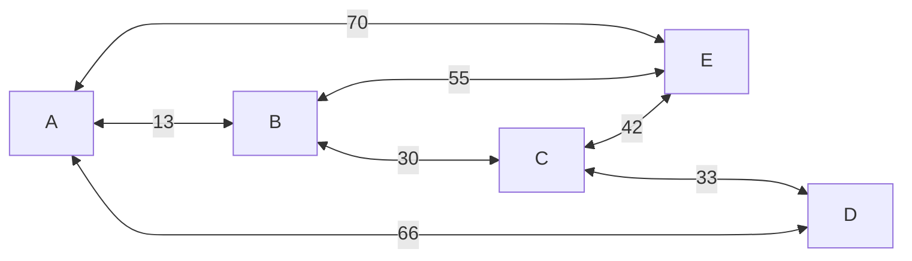
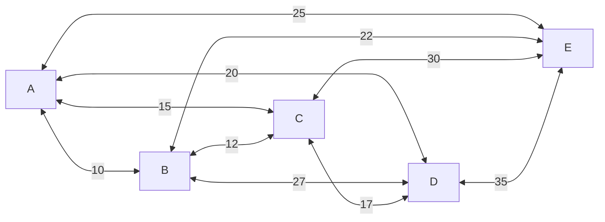
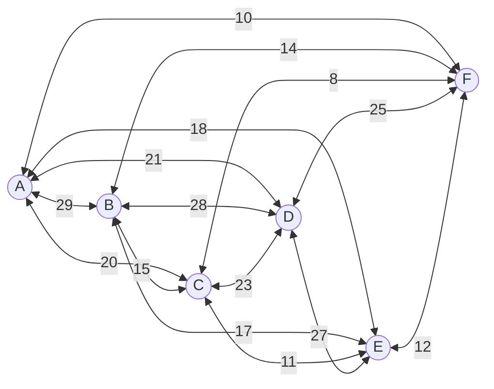
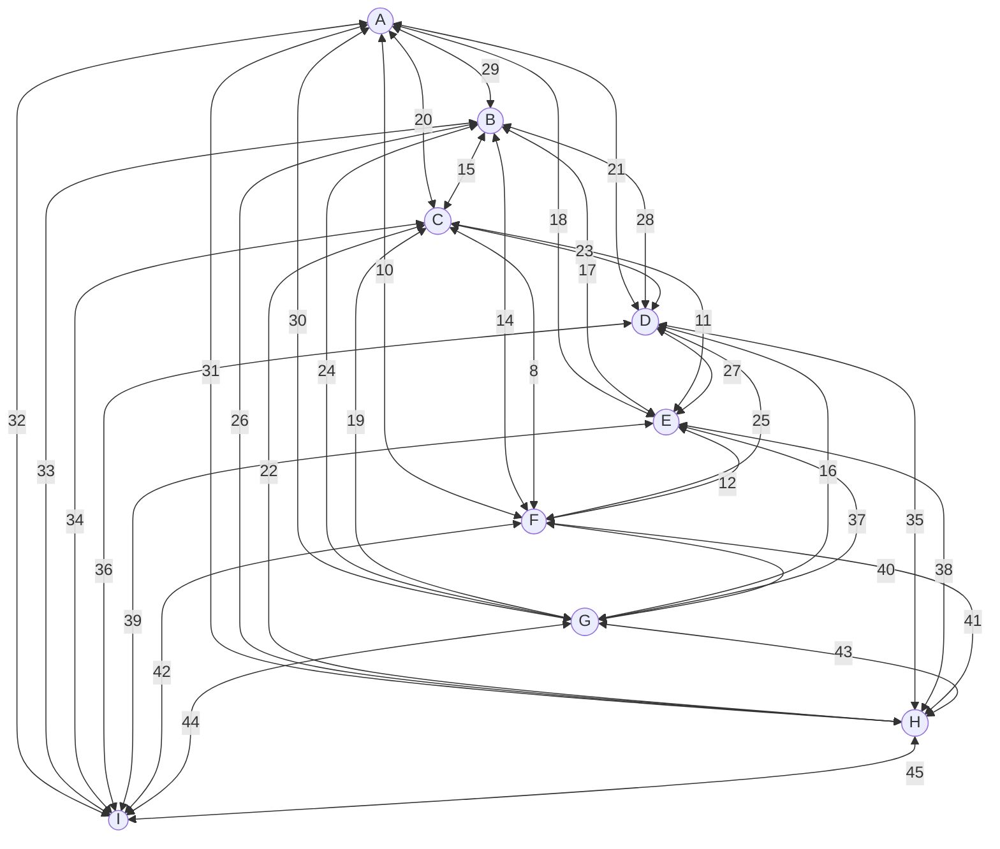

# Evolutionary Optimization

## Introduction to the problem

In this document, we will work on finding a solution to the Traveling Salesperson Problem (TSP). This problem involves a person that must find the shortest route between a set of points that must be visited. Each path between two points has a value corresponding to the length of said path.
<br/><br/>

For exemple, our Salesperson as a map:



Here, the shortest path has a length of 209 units and one way to do so would be <p style='text-align: center'>`C -> E -> B -> A -> C`</p>
The goal of this work is to implement an evolutionary algorithm that will be able to find a solution for any given map (i.e., a graph).

## Getting started

For an evolutionary algorithm to be evolutionary, it needs X parts:

- a population;
- a way to quantify the quality of each individuals (called fitness)
- a way to select individuals
- a reproduction system
- some mutations;

### The population

The population is the set of all proposed solutions of an evolutionary algorithm considered in one iteration. These solutions are also called individuals, in biological terms.

Since our goal is to find the shortest path between every point of the graph, we will take as population a set of 5 possible route. We will define a possible route as an arrangment of each and every points of the graph, no matter if a route exists between two given points.<br/>
This population might not be the best, but it will do the job at least for the beginning.

### Fitness

The fitness function will be the one responsible to know of an individual is good enough to serve as the solution of the problem.

To start slowly, let us say that a individual is good enough if a complete loop visiting each points in order is possible.

### Selection

The selection part may be the most important part of the evolution algorithm logic. It is this part that is in charge of picking some individual from the population, and remodeling them to create a brand new population.

For a first version of the algorithm, we will remove the less efficient route, according to the fitness function, and duplicate a random one from the 4 remaining individual. Then we will make them reproduce.

### Reproduction system

The reproduction system, or crossover, is the process responsible of creating a new population from the old one. 

In our case, the crossover will happen between the 5 selected individuals. Pairs of individuals will be created and fro each pair, a random number will be generated. This random number will be use to cut the path in two parts for each individual of the pair. Then, the last part of each individual will be swapped.

### Mutation

The mutation is the last part of the cycle and will be executed on the newly created population. This process' purpose is to modify each individual in order to may be find a better solutions.

Without mutation, the repoduction process will eventually led to a population based on the same individuals.

The mutation in our algorithm will consists of swapping two random points in each individual's proposed solution.

### Testing

- Parameters:

For the tests we will take the same graph as in the introduction:


- Steps:

To start, five individuals are selected to form the very first population

``` 
[['C', 'D', 'B', 'E', 'A'], ['E', 'D', 'B', 'C', 'A'], 
['A', 'D', 'B', 'E', 'C'], ['E', 'B', 'A', 'C', 'D'], 
['C', 'E', 'A', 'D', 'B']]
```

Then, the quality of each individuals is computed by the fitness function, which gives:

``` bash
[20.0, 0.0, 20.0, 80.0, 60.0] # Note that each value correspond to the percentage of fitness.
```
As none of the individuals satisfies completely the required fitness (which is 100.0), the algorithm will have to try new solutions.

After the selection, reproduction and mutation of the population, we are left with a brand new one:

```
[['C', 'D', 'E', 'B', 'C'], ['A', 'E', 'B', 'D', 'A'], 
['A', 'D', 'E', 'E', 'B'], ['B', 'C', 'A', 'C', 'D'], 
['A', 'D', 'E', 'E', 'B']]
```

which is evaluated by the fitness function as:

```
[20.0, 40.0, 20.0, 80.0, 20.0]
```

The quality of this population does not match our threshold. Therefore, we have to regenerate a new population.

After two new cycle, our algorithm eventually found a solution that match our expectations. Or has it ?

Let's evaluate the proposed solution:<p style='text-align: center'>C --> D --> A --> C --> A</p>

If we look at our graph, we can easily make this route without going through any non existing path. But there is one major problem concerning the rules of the TSP: we can not visit a point more than once AND we have to visit every point of the graph. If we take a closer look on the proposed solution, we will rapidly find out that we visit two times points A and C and never points B and E. So the proposed solution is not a solution.

The origin of the problem comes from the fact that when we cross two individuals, the part one take from one to plug into the other may contain points that are already visited in the original part.

To fix this problem, we can either:
- modify the fitness function to check if there are no points that are visited more than once, or
- modify the cross over part to change the duplicates points to the one not visited

Let's implement both separately to see which one is the best.

### Algorithm with modified fitness function:

The algorithm do not find any solutions in most of tries. The reason is that we did not fix the problem of 'visiting a point more than once' instead we just said that this kind of individual is not fit enough. So modifying the fitness function is not the solution here

### Algorithm with modified crossover function

This modification allows us to get a solution every time that respects the rule of visiting every point of the graph once.
In average, this algorithm finds a suitable solution after 3 generations with each generation process taking around 0.05ms. Which is quite efficient.

However, the given solution is not the optimum.

## Path length

One caracteristics of the TSP, and the one that make this problem so difficult to solve is that every path between two point has a length. So eventhough we find a route that visits every point in the graph, this may be not the most efficient one, and it might exists an other solution that is faster.

To implement this, we shall change the fitness function to not only check if the edge exists but also compute the total length of the route. But we can not just compute this length and add it to the fitness score, the result would make no sense in the end. Instead, one way to do it would be to take the difference between the length of the proposed route and the total length of the graph. The total length of the graph shall be the sum of all path length in the graph. Let's implement the new fitness function

### Test

After implementing this feature, it seems the algorithm can't find any solutions. There are two explainations. First, since we change the fitness function, it is now much more strict, thus giving lower grades to each individuals. As it is now impossible to reach 100.0 fitness score, as it it impossible to have a route length of 0, we should lower the threshold of acceptance. 

Then, the selection and crossover function are quite elitist. Because they keep only the most efficient individuals and duplicate one of them, the population tends to be composed of the same individuals.

### Optimization

Let's start by lowering the fitness threshold. First, we shall change the way of computing the fitness of the proposed route length of each individual. Since it is impossible to hit a 0-length route, we will obviously always travel a certain distance. So we should add a 'minimum authorized length'. We can easily say that the shortest route will cover at least 70% of the graph total length.

Already, changing the fitness threshold allows us to get a solution. Moreover, it seems to find the shortest path for the example graph every time.
With an average of 5 generation and around 0.07ms per generation, the efficiency of this algorithm is quite acceptable. At least for this graph. What about is an other graph ? Here is a graph with more inside connections, where the shortest path length is 96 units:



After some simulations, it seems it always finds a solution in the first generation. It does so because the shortest path length is much smaller than the total length of the graph. So, obviously it would be very likely to find a path short enough to meet our threshold of acceptance. In 100 simultations, the algorithm seems to find the shortest path only 33.0% of the time.

We could be fine with the proposed solution, given the algorithm finds it quite fast. However, the goal of the algorithm is to find the shortest path, not to find a solution among other in the shortest computation time (of course, finding the shortest path in the fastest way would be perfect). 

With that being said, we must find a solution to be sure, the found solution is actually the shortest path. We could change the fitness threshold, but it will fix the problem only for this graph.
What we should do, is to have a threshold in accordance of the fitness score of the generations. To do so, we can run the simultation for a few generation, take the maximum fitness score of all of these generation, and set it as the threshold of acceptance. But how many generations have to be generated before being sure the threshold will allow us to find the shortest path 100% of the time ? Well, let's test multiple values, like 5, 10, 50, 100:

Each simultation has been ran 100 times:
```bash
5 generations:
average total time: 0.72ms
average number of generations: 11
average time per generation: 0.06ms
success rate: 100.0%
shortest path found: 82.0%

10 generations:
average total time: 1.3ms
average number of generations: 22
average time per generation: 0.06ms
success rate: 100.0%
shortest path found: 90.0%

50 generations:
average total time: 3.51ms
average number of generations: 61
average time per generation: 0.06ms
success rate: 100.0%
shortest path found: 100.0%

100 generations:
average total time: 5.97
average number of generations: 112
average time per generation: 0.05ms
success rate: 100.0%
shortest path found: 100.0%
```

Based on the results, we can conclude that 10 generations is the best as it allows to find the shortest path 90% of the time and does not take too much generations to find a solution. 

But the efficiency of the algorithm can still be improved. As said before, the selection process is kind of elitist, which can led to a population based on the same individual. 

### Optimisation

As a reminder, the actual selection process remove the least efficient individual and replace it by duplicating one individual among the remaining in the popultation. This is especially this last step that is the most likely to led to a population of the same individual. To fix this, instead of duplicating an individual, we can create one from scratch. This will increase the diversity of the population, thus allowing the algorithm to have a wider range of research.

### Test

After 100 simulations, we get those results:

```bash
Average total time: 0.82
Average number of generations: 12
Average time per generation 0.06ms
success rate: 100.0%
Shortest path found: 100.0%
```

Again, each simulations waited for at least 10 generations before eventually giving a solution.

What can we say about these results ? Well, it shows that the fix we made to the algorithm are really efficient. We decreased the total computation time by 63%, the number of generations is 54% less and now, we find the shortest path 100% of the time.

So what can we say about elitism in evolutionary algorithm ? The tests results proved that strict elitism (all new individuals are from the best of the old population) reduces the efficency of the algorithm, both time and accuracy speaking. Instead a selection with a greater diversity allows to find the best solution faster with less generations, as it increase the area of search for a solution.

## Larger graphs

Now that we have a fairly efficent algorithm that always finds the best solution, let's try it with a bunch of differently shaped graphs.



This graph has 6 vertices, 15 edges and a shortest path of 95

Results:
```bash
Average total time: 1.47ms
Average number of generation 16
Average time per generation: 0.09ms
success rate: 100.0%
Shortest path found: 64.0%
```



This graph contains 9 vertices, 35 vertices with a shortest path of